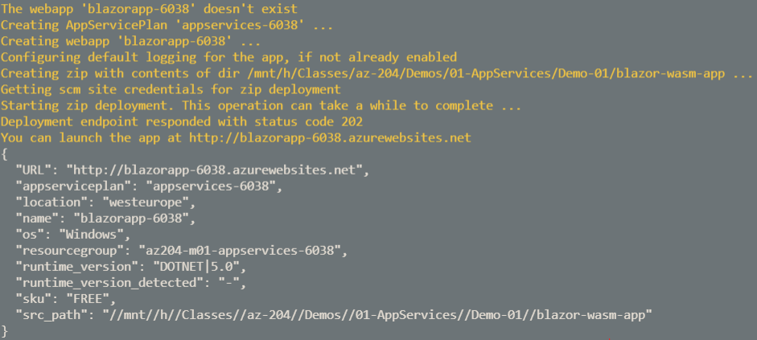

# Create App Service & Publish .NET Core Api using Portal & CLI

## Deploy using Azure App Service Extensions

Use [.NET Core CLI](https://docs.microsoft.com/en-us/dotnet/core/tools/) to create and test the app: 

```
dotnet new api -n CliApi
dotnet run
```

Publish app

```
dotnet publish
```


## Deploy using Publishing Profile

Navigate to `./FirstMVC/Properties/PublishProfile`

Add a file called `azure.pubxml` with the following content:

```xml
<Project>
    <PropertyGroup>
    <PublishProtocol>Kudu</PublishProtocol>
    <PublishSiteName>{Your App name}</PublishSiteName>
    <UserName>{Your FTP/deployment username}</UserName>
    <Password>{Your FTP/deployment password}</Password>
    </PropertyGroup>
</Project>
```

Execute:

```
dotnet publish /p:Configuration=Release /p:PublishProfile=Properties\PublishProfiles\azure.pubxml /p:Password=<password>
```

> Note: Make sure you use the published path

## Deploy using az webapp up

Usually you would create an app service plan and a web app using:

```
az appservice plan create -n $appPlan -g $grp --sku Free
az webapp create -n $app -g $grp --plan $appPlan --runtime "DOTNET|5.0"
```

`az webapp up` replaces the two step below, build, publishes and deploys the web app. Navigate to `./FirstApi/` and execute:

```bash
rnd=$RANDOM
loc=westeurope
grp=az204-m01-appservices-$rnd
app=firstapi-$rnd
appPlan=appservice-$rnd

az group create -n $grp -l $loc
az webapp up -n $app -g $grp -p $appPlan -l $loc --sku Free -r "DOTNET|5.0"
```


