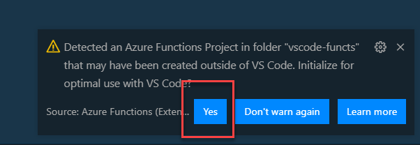

# Azure Function Core Tools

[Work with Azure Functions Core Tools](https://docs.microsoft.com/en-us/azure/azure-functions/functions-run-local?tabs=windows%2Ccsharp%2Cbash#v2)

Install azure-function-tools:

```
npm i -g azure-functions-core-tools
npm i -g azure-functions-core-tools@3 --unsafe-perm true
```

> Note: Documentaion can be found on [Github](https://github.com/Azure/azure-functions-core-tools) or on [Work with Azure Functions Core Tools](https://docs.microsoft.com/en-us/azure/azure-functions/functions-run-local?tabs=windows%2Ccsharp%2Cbash)

Scaffold Project:

```
func init vscode-functs --dotnet
cd vscode-functs
```

> Note: Choose "yes" in init for VS Code Popup



## Testing

To Execute REST Calls you could use:

-   httprepl
-   [az rest](https://docs.microsoft.com/en-us/cli/azure/reference-index?view=azure-cli-latest#az_rest)
-   Postman

Install httprepl:

```
dotnet tool install -g Microsoft.dotnet-httprepl
```

For [Storage Account Testing and Emulation](https://docs.microsoft.com/en-us/azure/storage/common/storage-use-emulator) download the [Local Storage Account Emulator](https://go.microsoft.com/fwlink/?linkid=717179&clcid=0x409)

## Demo VS Code Function Apps

Provision required Services:

Create Funtion App in Azure manually or using `create-func-app.azcli`

Create a new Function:

```
func new --name MyHttpTrigger --template "HttpTrigger"
```

Run function locally:

```
func start --build
```

or use host keyword requried in v1

```
func host start --build
```

Execute in another terminal:

```bash
az rest -m post -u http://localhost:7071/api/MyHttpTrigger -b "{'name':'Azure Rocks'}"
```

Publish App to Azure using CLI

```
func azure functionapp publish vscodeapp-7179
```
