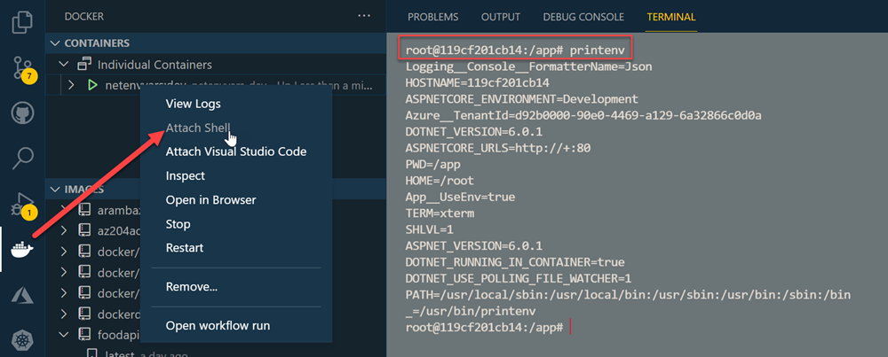

# Debugging Containers & Overwriting Config with Environment Variables in ACI

Create a `debug.dockerfile`:

```yml
FROM mcr.microsoft.com/dotnet/aspnet:6.0 AS base
WORKDIR /app
EXPOSE 80

ENV ASPNETCORE_URLS=http://+:80

FROM mcr.microsoft.com/dotnet/sdk:6.0 AS build
WORKDIR /src
COPY ["net-env-vars.csproj", "./"]
RUN dotnet restore "net-env-vars.csproj"
COPY . .
WORKDIR "/src/."
RUN dotnet build "net-env-vars.csproj" -c Release -o /app/build

FROM build AS publish
RUN dotnet publish "net-env-vars.csproj" -c Release -o /app/publish /p:UseAppHost=false

FROM base AS final
WORKDIR /app
COPY --from=publish /app/publish .
ENTRYPOINT ["dotnet", "net-env-vars.dll"]
```

Use the [Docker - Visual Studio Code Extension](https://marketplace.visualstudio.com/items?itemName=ms-azuretools.vscode-docker) to create a Docker Debug Configuration:


Update the `docker-build` task `dockerfile` prop to use `debug.dockerfile`:

```json
{
    "type": "docker-build",
    "label": "docker-build: debug",
    "dependsOn": [
        "build"
    ],
    "dockerBuild": {
        "tag": "netenvvars:dev",
        "target": "base",
        "dockerfile": "${workspaceFolder}/debug.dockerfile",
        "context": "${workspaceFolder}",
        "pull": true,
    },
    "netCore": {
        "appProject": "${workspaceFolder}/net-env-vars.csproj"
    },
},
```

For container debugging customize `docker-run: debug` in `.vscode/tasks.json`:

```json
{
    "type": "docker-run",
    "label": "docker-run: debug",
    "dependsOn": [
        "docker-build: debug"
    ],
    "dockerRun": {
        "ports": [{"hostPort": 5050, "containerPort": 80}],
        "env": {            
            "App__UseEnv":"true",
            "Azure__TenantId":"d92b0000-90e0-4469-a129-6a32866c0d0a"
        }
    },
    "netCore": {
        "appProject": "${workspaceFolder}/net-env-vars.csproj",
        "enableDebugging": true
    }
},
```

Set container environment variables:

```json
"env": {            
    "App__UseEnv":"true",
    "Azure__TenantId":"d92b0000-90e0-4469-a129-6a32866c0d0a"
}
```

>Note: `Azure__TenantId` mimics the structure of `appsettings.json`:

```json
{ 
  "Azure": {
  "TenantId": "d92b247e-90e0-4469-a129-6a32866c0d0a",
```

Set the port mapping:

```json
"ports": [{"hostPort": 5050, "containerPort": 80}],
```

Set your startup url in `launch.json` to route to the `SettingsController` using `dockerServerReadyAction`:

```json
{
    "name": "Docker Debug",
    "type": "docker",
    "request": "launch",
    "preLaunchTask": "docker-run: debug",
    "netCore": {
        "appProject": "${workspaceFolder}/net-env-vars.csproj"
    },
    "dockerServerReadyAction": {
        "uriFormat": "%s://localhost:%s/settings"
    }
}
```

Notice that the overrided value for the `TenantId` is returned:


`Attach to shell` and use `printenv` to show the variables in the container:



Build and publish image:

```bash
docker build --rm -f dockerfile -t net-env-vars:debug .
docker tag net-env-vars:debug arambazamba/net-env-vars:debug
docker push arambazamba/net-env-vars:debug
```

Test in [Azure Container Instances](https://docs.microsoft.com/en-us/azure/container-instances/) by executing `../deploy-to-aci.azcli`:

```bash
rnd=$RANDOM
grp=az204-m05-ci-env-$rnd
loc=westeurope
app=net-env-vars-$RANDOM
img=arambazamba/net-env-vars:debug

az group create -n $grp -l $loc

az container create -g $grp -l $loc -n $app --image $img --cpu 1 --memory 1 --dns-name-label $app --port 80 \
    --environment-variables 'App__UseEnv'='true' 'Azure__TenantId'='d9101010-90e0-4469-a129-6a32866c0d0a' \
    --query ipAddress.fqdn -o tsv
```
