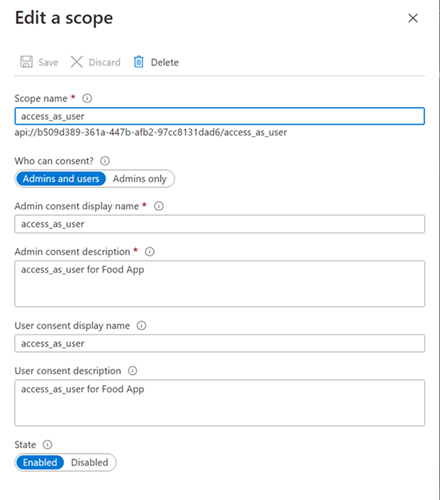

# MSAL secured .NET 6 Api consumed by Angular App using `@azure/msal-angular`

[.NET Core Authentication Snippets](https://docs.microsoft.com/en-us/aspnet/core/security/authentication/social/microsoft-logins?view=aspnetcore-6.0)

[Tutorial: Sign in users and call the Microsoft Graph API from an Angular single-page application (SPA) using auth code flow](https://docs.microsoft.com/en-us/azure/active-directory/develop/tutorial-v2-angular-auth-code)

## Demo

- Create App Registrations
- Configure Angular MSAL Auth
- Configure Api MSAL 

### Create App Registrations

- Requires two app registrations. One for `food-api`, one for `food-ui`.

  

- To create API App Registration execute `create-api-appreg.azcli`

  

  

  

- To create UI App Registration use the User Interface. `create-ui-appreg.azcli` is a draft. Not all required pros can be set using Azure CLI.

  

  

---
### Configure .NET Api MSAL Auth

`appsettings.json` allows enabling / disabling of auth and stores `TenantId` and `ClientId` of the Api App Registration:

```json
"App": {
    "Title": "",
    "AuthEnabled": true,
    "UseSQLite": true,
    "ConnectionStrings": {
        "SQLiteDBConnection": "Data Source=./food.db",
        "SQLServerConnection": "..."
    }
},
"Azure": {
    "TenantId": "d92b247e-90e0-4469-a129-6a32866c0d0a",
    "ClientId": "b509d389-361a-447b-afb2-97cc8131dad6",
    "Instance": "https://login.microsoftonline.com/",
    "cacheLocation": "localStorage",
```

`Program.cs` registeres OpenIDConnect Authentication for the [On-Behalf-Of-Auth-Flow](https://learn.microsoft.com/en-us/azure/active-directory/develop/v2-oauth2-on-behalf-of-flow) and assigns an Authorization policy on the Controllers:

```c#
var az = Configuration.GetSection("Azure");
if (cfg.App.AuthEnabled && az != null)
{
    builder.Services.AddAuthentication(JwtBearerDefaults.AuthenticationScheme)
    .AddMicrosoftIdentityWebApi(az)
    .EnableTokenAcquisitionToCallDownstreamApi()
    .AddInMemoryTokenCaches();
    builder.Services.AddAuthorization();

    //Add auth policy instead of Autorize Attribute on Controllers
    builder.Services.AddControllers(obj =>
    {
        var policy = new AuthorizationPolicyBuilder()
            .RequireAuthenticatedUser()
            .Build();
        obj.Filters.Add(new AuthorizeFilter(policy));
    });
}
```

You can test the Api and its auth with `foodapi-tests.http` and the REST Client extension in VS Code:

```
# @name auth
POST https://login.microsoftonline.com/{{tenantId}}/oauth2/v2.0/token HTTP/1.1
Content-type: application/x-www-form-urlencoded

grant_type=client_credentials
&client_id={{clientId}}
&client_secret={{clientSecret}}
&scope={{scope}}

### Get all food
GET https://localhost:5001/food HTTP/1.1
Content-Type: application/json
Authorization: Bearer {{auth.response.body.access_token}}
```
---
### Configure Angular MSAL Auth

MSAL Auth Code Grant will be using the following libraries:

```
"@azure/msal-angular": "^2.4.5",
"@azure/msal-browser": "^2.30.0",
```

Update `environment.ts` and notice the custom scopes for the Api using `https://localhost:5001/food` and `access_as_user`:

```typescript
export const environment = {
  production: false,
  authEnabled: true,
  apiUrl: 'https://localhost:5001/',
  azure: {
    applicationInsights: 'a196d36f-...',
    appReg: {
      clientId: 'd23642f7-...',
      authority:
        'https://login.microsoftonline.com/d92b247e-.../',
      redirectUri: 'http://localhost:4200/',
      scopes: [
        ['https://graph.microsoft.com/v1.0/me', ['user.read']],
        [
          'https://localhost:5001/food',
          ['api://b509d389-.../access_as_user'],
        ],
      ],
    },
  },
};
```

To keep the root module clean, most of the msal activity is implemented in `auth/msal-auth-util.module.ts` and `auth.facade.ts`. auth.module.ts is imported into `app.module.ts`:

```typescript
@NgModule({
  declarations: [...],
  imports: [
    ...
    MsalAuthUtilModule,
  ],
```


`msal-auth-util.module.ts` conditionally registers Interceptors and Guards depending on the `environment.authEnabled` flag:

```typescript
const providers = environment.authEnabled
  ? [
      MsalAuthFacade,
      {
        provide: HTTP_INTERCEPTORS,
        useClass: MsalInterceptor,
        multi: true,
      },
      {
        provide: MSAL_INSTANCE,
        useFactory: MSALInstanceFactory,
      },
      {
        provide: MSAL_GUARD_CONFIG,
        useFactory: MSALGuardConfigFactory,
      },
      {
        provide: MSAL_INTERCEPTOR_CONFIG,
        useFactory: MSALInterceptorConfigFactory,
      },
      MsalService,
      MsalGuard,
      MsalBroadcastService,
    ]
  : [
      MsalAuthFacade,
      { provide: MsalBroadcastService, useClass: MsalBroadcastServiceMock },
    ];
```

`auth.facade.ts` is the main entry point for the auth flow. Its MSALInstanceFactory creates the Public Client Application:

```typescript
export function MSALInstanceFactory(): IPublicClientApplication {
  let config = {
    auth: {
      clientId: environment.azure.appReg.clientId,
      authority: environment.azure.appReg.authority,
      redirectUri: '/',
    },
    cache: {
      cacheLocation: BrowserCacheLocation.LocalStorage,
      storeAuthStateInCookie: isIE, // set to true for IE 11
    },
    system: {
      loggerOptions: {
        loggerCallback,
        logLevel: LogLevel.Info,
        piiLoggingEnabled: false,
      },
    },
  };
  return new PublicClientApplication(config);
}
```

>Note: Additional docs on [dynamic MSAL configuration can be found here](https://github.com/AzureAD/microsoft-authentication-library-for-js/blob/dev/lib/msal-angular/docs/v2-docs/configuration.md).
