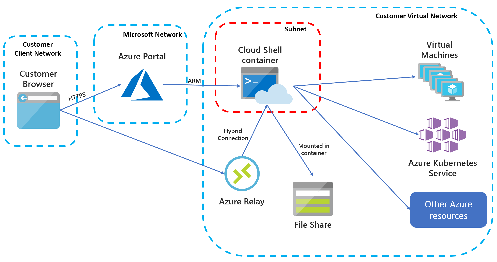
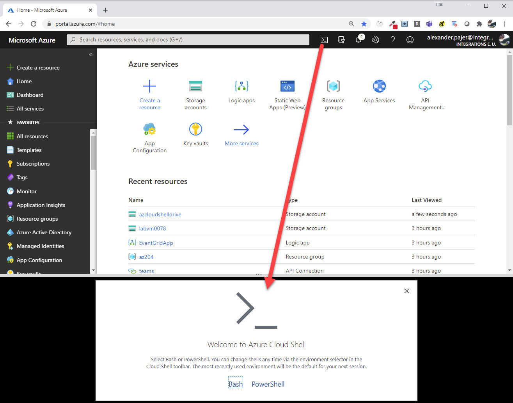
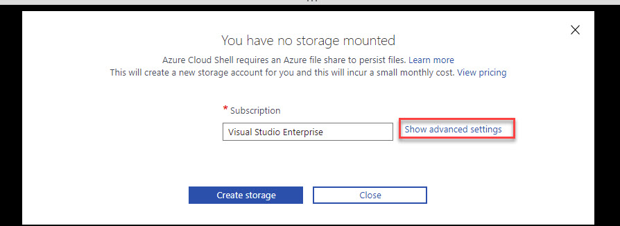
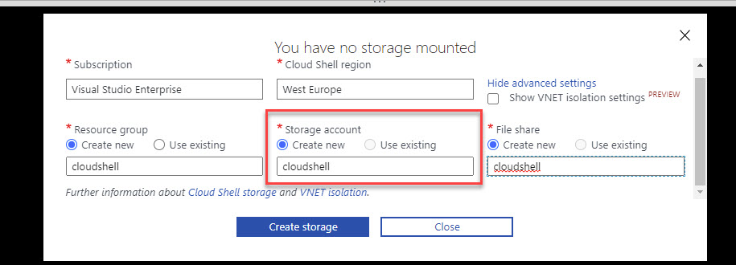

# Using Azure CLI & Cloud Shell

## Azure CLI

[Azure CLI Reference](https://docs.microsoft.com/en-us/cli/azure/reference-index?view=azure-cli-latest)

[Azure CLI Query](https://docs.microsoft.com/en-us/cli/azure/query-azure-cli?view=azure-cli-latest)

[JMESPath Documentation](http://jmespath.org/)

## Extensions

[Azure Account](https://marketplace.visualstudio.com/items?itemName=ms-vscode.azure-account) and [Azure CLI Tools](https://marketplace.visualstudio.com/items?itemName=ms-vscode.azurecli) connect to [Azure Cloud Shell](https://docs.microsoft.com/en-us/azure/cloud-shell/overview#:~:text=Azure%20Cloud%20Shell%20is%20an,work%2C%20either%20Bash%20or%20PowerShell.&text=Direct%20link%3A%20Open%20a%20browser,%3A%2F%2Fshell.azure.com.)



## <a id="configure-cloud-shell">Configure CloudShell for first use

Open the Cloud Shell to configure it for first use:



Chose Bash and your subscription



>Note: Optional you can provide a meaningfull name to your Clould Shell Storage using Advanced Settings:



> Note: To reset CloudShell you can use `Dismount-Clouddrive`

## Install Azure CLI on your local machine

Install Azure CLI in an elevated PowerShell prompt:

```
Invoke-WebRequest -Uri https://aka.ms/installazurecliwindows -OutFile .\AzureCLI.msi; Start-Process msiexec.exe -Wait -ArgumentList '/I AzureCLI.msi /quiet'; rm .\AzureCLI.msi
```

> Note: To install Azure CLI in Linux (ie. WSL) execute `install-az-cli.sh` from Setup/windows-subsystem-linux folder

## Azure CLI getting started

Log In:

```bash
az login
```

Try at cmd - use ctrl + d to exit:

```
az interactive
```

> Note: You can also use: `F1 - Open Bash in Cloud Shell` using Azure Account Extension


List available extensions:

```bash
az extension list-available --output table
az extension add --name <extension-name>
```

Set Azrue CLI to auto-update:

```bash
az config set extension.use_dynamic_install=yes_without_prompt
```

### List and set Subscriptions

List Subscriptions:

```
az account list -o table
```

Set default Subscription:

```
az account set --subscription <name or id>
```
### Create an App Service to host a Web App:

```bash
rnd=$RANDOM
grp=az204-appservice-$rnd
appPlan=appservice-$rnd
web=foodweb-$rnd
loc=westeurope

# create a resource group
az group create -n $grp -l $loc

# create an App Service plan
az appservice plan create -n $appPlan -g $grp --sku B2
```

> Note: You could also execute `creat-app-service.azcli` or run the following remote script in Cloud Shell

```
curl https://raw.githubusercontent.com/ARambazamba/AZ-204/master/Labs/create-lab-vm.sh | bash
```

### Create a Lab VM

If you want to execute the labs on a machine where you have full controll please follow this guide:

- Execute `create-lab-vm.azcli`
- Wait unitl the machine has been pvovisioned
- Connect to the VM using RDP
- Execute `Set-ExecutionPolicy bypass` in an elevated prompt using `run as administrator`
- Execute the script `setup-az-204.ps1` in an elevated prompt

> Note: To connect use the credientials from script `create-lab-vm.azcli`

```
rnd=$RANDOM
loc=westeurope
grp=az-lab
vmname=labvm-$rnd
user=azlabadmin
pwd=Lab@dmin1234
vmname=labvault-$rnd

az group create -n $grp -l $loc

az vm create -g $grp -n $vmname --admin-username $user --admin-password $pwd --image  MicrosoftWindowsDesktop:Windows-10:21h1-pro:19043.1237.2109130412 --size Standard_E2s_v3
```

> Note: We are using this image and vm size because it supports nested virtualization

### Troubleshoot CLI

Select Directory:

https://shell.azure.com/

In my case issue resolved by reverting Azure Account extension version to 0.8.11.

## Additional Labs & Walkthroughs

[Control Azure services with the CLI](https://docs.microsoft.com/en-us/learn/modules/control-azure-services-with-cli/)
